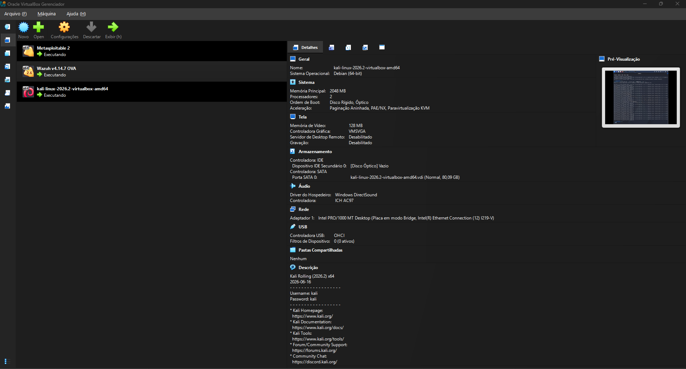
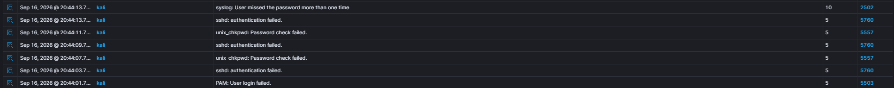
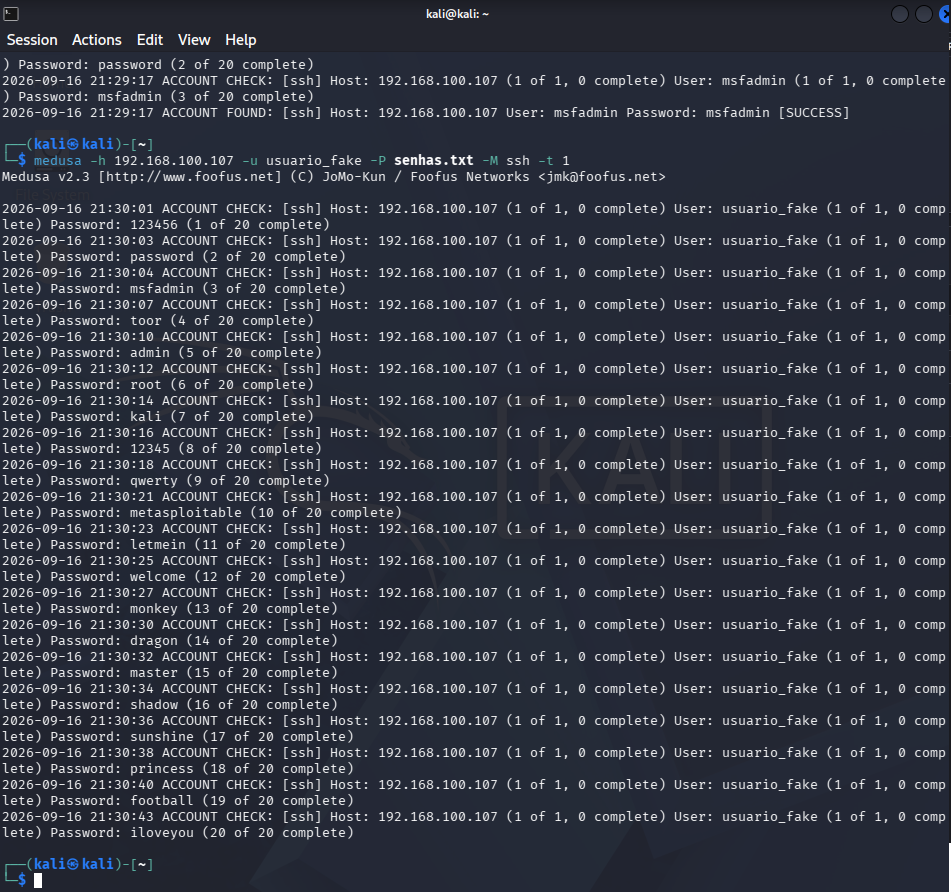
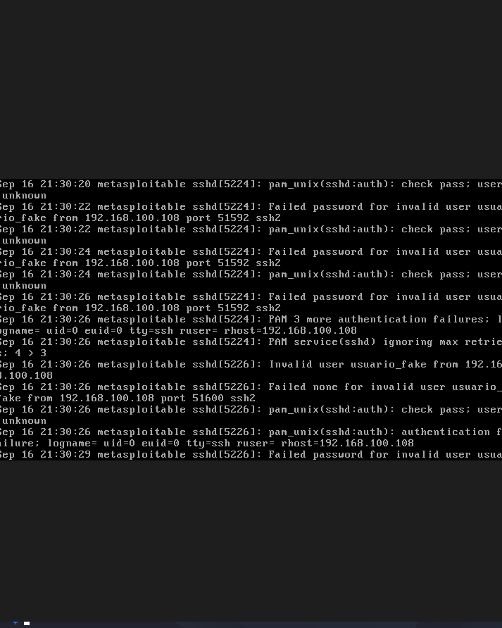
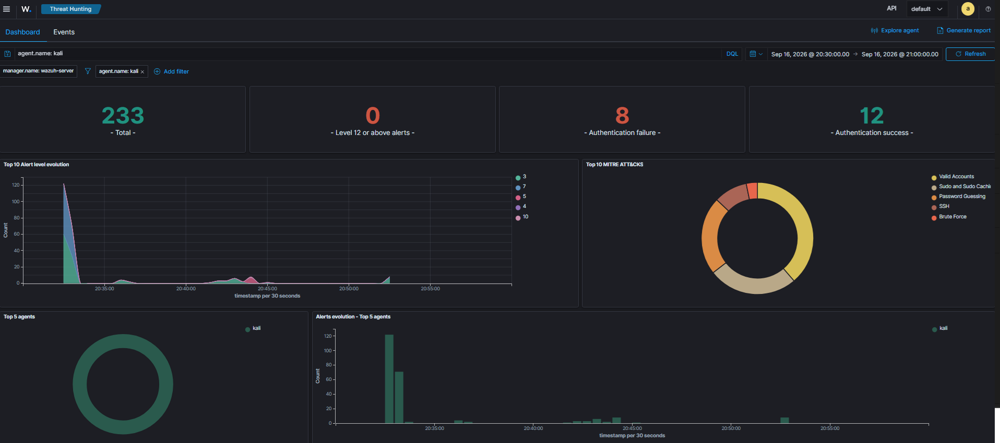
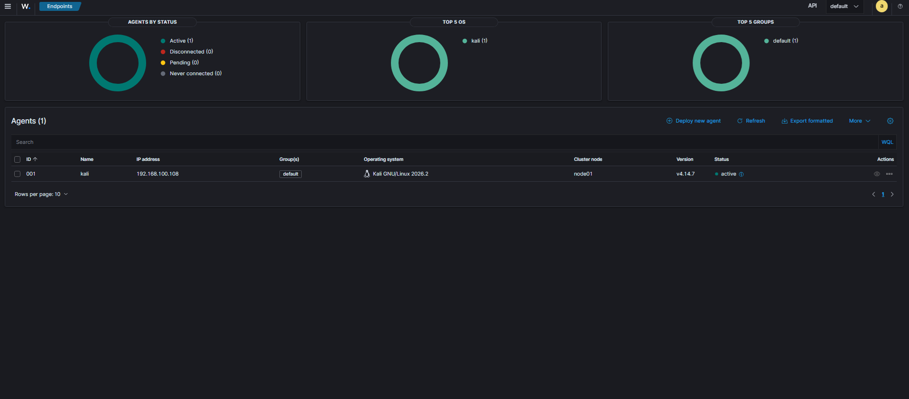
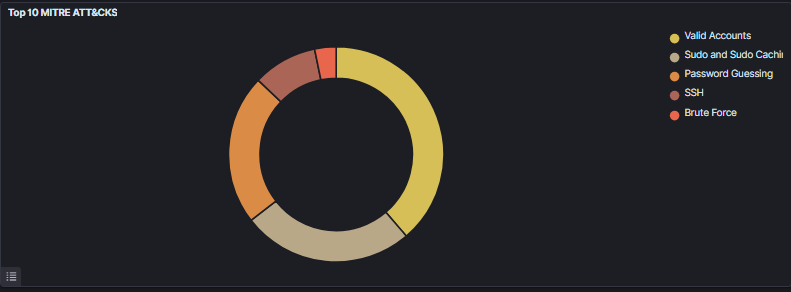
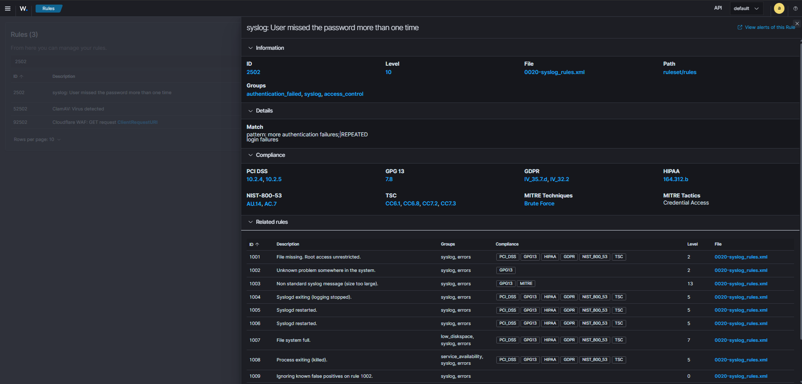

# SOC Lab com Wazuh SIEM

Laboratório de Security Operations Center (SOC) construído para praticar detecção de incidentes, análise de logs e resposta a ataques em ambiente isolado.

## Objetivo

Simular ataques reais contra alvos vulneráveis e validar a capacidade de detecção do Wazuh SIEM, documentando cada cenário no formato de relatório de incidente.

## Arquitetura

| VM | Função | IP |
|---|---|---|
| Wazuh Server | SIEM / Manager | 192.168.100.106 |
| Kali Linux | Atacante + Endpoint monitorado | 192.168.100.108 |
| Metasploitable 2 | Alvo vulnerável | 192.168.100.107 |

Rede isolada em modo Bridge. Wazuh coleta logs via agente no Kali.

## Stack

- Wazuh 4.14.7 (SIEM)
- VirtualBox (virtualização)
- Kali Linux (ataques + endpoint)
- Metasploitable 2 (alvo)
- Medusa (brute force SSH)
- Hydra (tentativa inicial)
- Python (scripts auxiliares)

## Cenários de Ataque

### Cenário 1: Brute Force SSH contra o Kali

- **Ferramenta:** SSH client com senha errada (simulação manual)
- **Detecção:** Regras 5760, 5557 e correlação na 2502 (nível 10)
- **MITRE ATT&CK:** T1110 (Brute Force), T1078 (Valid Accounts)
- **Tempo de detecção:** ~10 segundos
- **Resultado:** Alerta de alta severidade disparado no Dashboard

📄 [Relatório completo do incidente](reports/incident-01-brute-force.md)

### Cenário 2: Brute Force SSH contra o Metasploitable 2

- **Ferramenta:** Medusa com wordlist de 20 senhas comuns
- **Resultado:** Credencial `msfadmin` encontrada em 3 tentativas
- **Evidência:** `auth.log` do alvo registrou todas as tentativas
- **MITRE ATT&CK:** T1110.001 (Password Guessing)
- **Observação:** Sistema legado (Ubuntu 8.04) sem suporte a agente Wazuh moderno

## Evidências

| Print | Descrição |
|---|---|
|  | Visão geral do Dashboard Wazuh |
|  | Agente Kali ativo |
|  | Técnicas MITRE ATT&CK detectadas |
|  | Detalhe da regra 2502 |

## Aprendizados

- Configuração de SIEM em ambiente isolado com múltiplas VMs
- Análise de logs de autenticação (auth.log, journald)
- Correlação de eventos no Wazuh e interpretação de rule levels
- Mapeamento de técnicas MITRE ATT&CK
- Limitações de ferramentas modernas contra sistemas legados
- Importância de hardening (credenciais padrão, SSH por senha)

## Próximos Passos

- [ ] Instalar agente Wazuh em sistemas legados via Syslog remoto
- [ ] Criar regras customizadas de detecção
- [ ] Integrar alertas com Discord/Telegram
- [ ] Mapear mais técnicas do MITRE ATT&CK
- [ ] Automatizar resposta a incidentes com Active Response

## Aviso Legal

Todo o conteúdo deste repositório foi produzido em ambiente controlado e isolado, com fins exclusivamente educacionais. Nenhum sistema real foi alvo dos testes.
